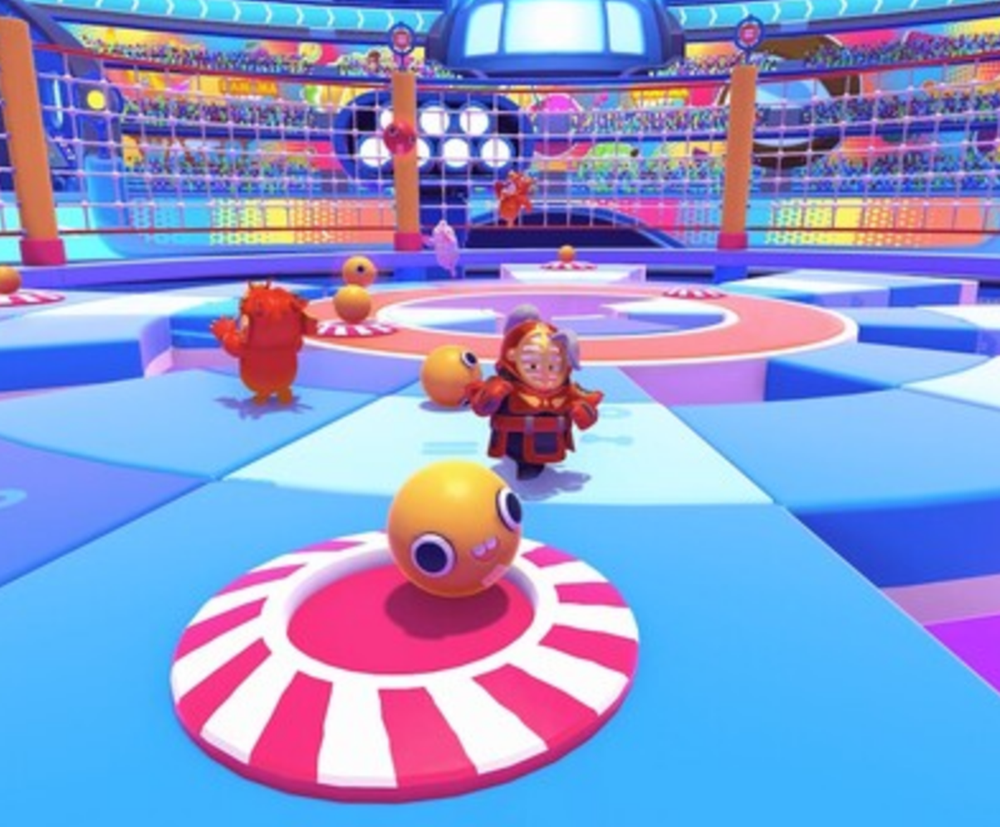

# Anyway-I-didn-t-do-it

## 캐쥬얼 서바이벌 게임 Anyway I didn't do it

### ▶️ UCC
(이미지를 누르면 영상 링크로 이동합니다.)

### 🎮 시연 영상
(이미지를 누르면 영상 링크로 이동합니다.)

### 📑 기획

  
  

 

- 초기 개발 기간이 짧은 것을 고려하여 캐주얼한 게임을 목표로 개발
- 사람들이 가장 쉽게 재미를 느낄 수 있게 대전을 기반으로 제작

### 🔥 게임 스토리

> 발 디딜 틈 없이 꽉차버린 지옥, 지옥의 관리자는 지옥을 널널하게 만들기 위해 고민을 하는데.
> 지옥에서 펼쳐지는 엔터테인먼트!
> 천국으로 가기 위해 7가지 지옥에서 펼쳐지는 배틀로얄.
> 최후의 승리자는 누구?

### 📂 시스템 아키텍처

### UVCS를 통한 브랜치 관리

- 큰 유니티 에셋 용량 - > 큰 용량 관리 편리 2만개 이상의 브랜치 관리 가능
  -> 기록 관리 유리한 측면 있음

## 게임 특징

### 다양한 애니메이션

- 애니메이션 블렌드 트리를 사용하여 앞뒤좌우 부드러운 애니메이션 구현

- 애니메이션 이모트를 사용한 티배깅 가능

### 유령

- 죽을 경우 유령이 되어 부활
- 유령의 영역에 닿으면 감속
- 위치 선정 및 적절한 대쉬 사용 -> 전략적 다양성 증가!

### 랭킹

- 라운드는 총 3라운드, 라운드마다 등수에 따른 점수 획득
- 마지막 라운드 종료 후 최종 우승자의 이긴 횟수를 업데이트 & 랭킹 보드에서 실시간 확인 가능

### 다양한 맵

#### 살인 지옥 (불 맵)

  
  

    <strong>화산에서 날라오는 마그마를 피하세요.
  

#### 천륜 지옥 (사막 맵)

  
  

    <strong>모래바람이 시야를 가립니다
  

#### 불의 지옥 (얼음 맵)

  
  

    <strong>미끄러운 바닥을
	조심하세요
  

#### 배신 지옥 (거울 맵)

  
  

    <strong>방향키는 나를 배신했다.
  

#### 폭력 지옥 (바람 맵)

  
  

    <strong>돌아가는 바퀴에서 살아남으세요.
  

#### 거짓 지옥 (칼 맵)

  
  

    <strong>떨어지면 죽습니다.
  

#### 나태 지옥 (강 맵)

  
  

    <strong>뗏목 위에서 살아남으세요
  

 
 

## 💻 Stacks

### Client

### Server

### Infra

### ETC

## 팀원 소개

|                                             이예원                                             |                                             변재혁                                              |                                             권용수                                              |                                             진홍엽                                              |                                             정기영                                              |                                             조민우                                              |
| :--------------------------------------------------------------------------------------------: | :---------------------------------------------------------------------------------------------: | :---------------------------------------------------------------------------------------------: | :---------------------------------------------------------------------------------------------: | :---------------------------------------------------------------------------------------------: | :---------------------------------------------------------------------------------------------: |
|                                           서버 / UI                                            |                                            서버 / UI                                            |                                          캐릭터 / 스킬                                          |                                          캐릭터 / 스킬                                          |                                          맵제작 / 화살                                          |                                          맵제작 / 화살                                          |
|                              [Eyekrw](https://github.com/Eyekrw)                               |                                                                                             |                               [kwonwd](https://github.com/kwonwd)                               |                             [HYndrome](https://github.com/HYndrome)                             |                       [FlashingFuture](https://github.com/FlashingFuture)                       |                             [mauercho](https://github.com/mauercho)                             |
|  |  |  |  |  |  |
